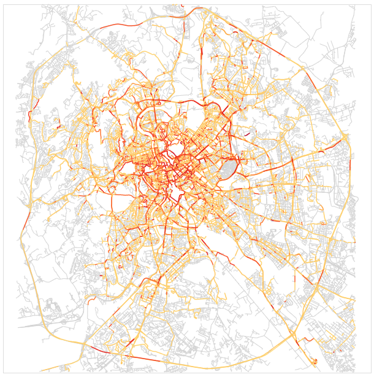
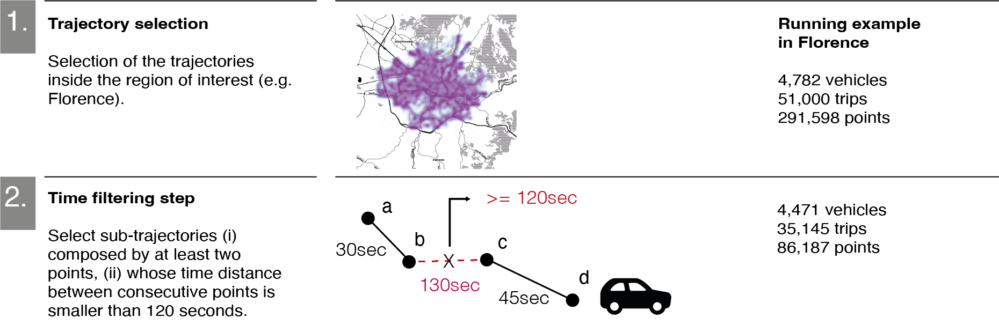
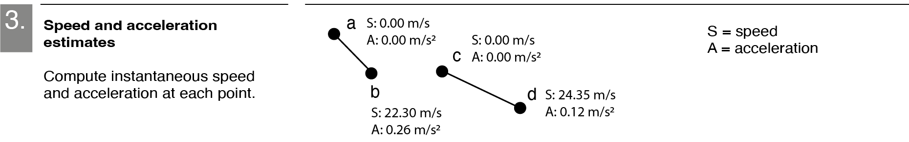
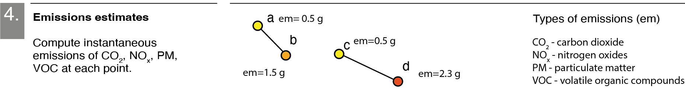
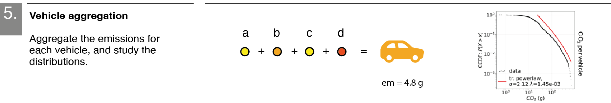
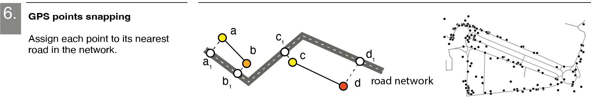
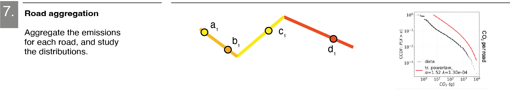
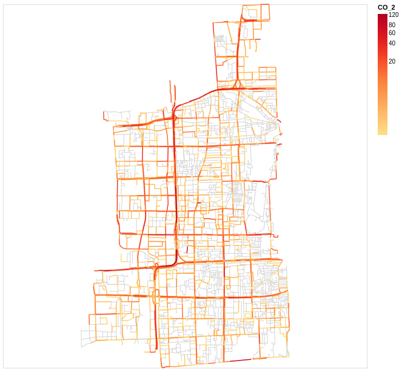

# Computing vehicles' emissions on the road network

<figure>

</figure>

This repository is a collection of methods that can be used to estimate the instantaneous emissions of four air pollutants (CO2, NOx, PM, VOC) starting from the GPS trajectories describing the vehicles' trips.

Note: the methods contained in ```mobair``` mainly rely on the Python libraries [scikit-mobility](https://github.com/scikit-mobility/scikit-mobility) [1] and [OSMnx](https://github.com/gboeing/osmnx) [2].

### Publications
Böhm, M., Nanni, M. & Pappalardo, L. Gross polluters and vehicle emissions reduction. Nat Sustain (2022). https://doi.org/10.1038/s41893-022-00903-x

The code used for the figures of the paper is in `notebooks/paper_figures.ipynb`.

## Outline
The methods collected in `mobair` allow:
* trajectory preprocessing (such as trips identification, trajectory filtering);
* speed/acceleration computation: compute the values of speed and acceleration in each point of a trajectory;
* points snapping: match the points to the edges (roads) or nodes (crossroads) of a road network;
* computation of emissions: compute the instantaneous emissions of CO2, NOx, PM, VOC in each point;
* visualize the emissions on the road network.


## Step-by-step procedure
What follows is the step-by-step procedure for the estimation of the vehicles' emissions starting from their raw mobility trajectories.
### Preprocessing
After some preprocessing of the trajectory data such as trajectory selection and filtering (for which we remand to the [example notebook](https://github.com/matteoboh/mobility_emissions/blob/5003f0bc4c9bc404f3e6915aa0f576eda37d7048/notebooks/example_with_public_data.ipynb)), we resume the fundamental steps for estimating the emissions in the following.



### Vehicles' speed and acceleration

With the module `speed` we can compute the instantaneous speed and acceleration of the vehicle in each of the points forming its trajectory, and then eventually filter out points with unrealistic values.
```python
from mobair import speed

max_speed = 300
max_acc = 10

tdf_with_speed_and_acc = speed.compute_acceleration_from_tdf(tdf)
ftdf = tdf_with_speed_and_acc[(tdf_with_speed_and_acc['acceleration'] < max_acc) &
                              (tdf_with_speed_and_acc['acceleration'] > -max_acc) &
                              (tdf_with_speed_and_acc['speed'] < max_speed)]
print(ftdf.head())
```
```python
   uid            datetime        lng       lat  tid      speed  acceleration
0    2 2008-02-02 13:37:16  116.37481  39.88782    1   0.000000      0.000000
1    2 2008-02-02 13:38:53  116.37677  39.88791    1   1.727076      0.017805
2    2 2008-02-02 13:42:18  116.38033  39.88795    2   0.000000      0.000000
3    2 2008-02-02 13:43:55  116.39392  39.89014    2  12.214172      0.125919
```

### Vehicle's emissions

Now, whether we have the information about each vehicle's engine type or not, we can exploit this information together with a table with emissions functions to estimate the vehicles' instantaneous emissions in each point, with the module `emissions`.
```python
import numpy as np

# in this example, we do not have any information on the vehicles' engines, so we set 5% of the vehicles to be LPG vehicles, 20% to be diesel vehicles, and the rest petrol.
set_uids = set(tdf_with_speed_and_acc.uid)
map__vehicle__fuel_type = {uid : np.random.choice(['PETROL', 'DIESEL', 'LPG'], 1, p=[0.75, 0.2, 0.05]).item() for uid in set_uids}

## loading the emissions functions
import pandas as pd
df_emissions = pd.read_csv('./data/private/emission_functions.csv')

## computing emissions
from mobair import emissions
tdf_with_emissions = emissions.compute_emissions(tdf_with_speed_and_acc, df_emissions, map__vehicle__fuel_type)
print(tdf_with_emissions.head())
```
```python
     uid            datetime        lng       lat  tid   ...       CO_2      NO_x   ...
0      2 2008-02-02 13:37:16  116.37481  39.88782    1   ...   0.553000  0.000619   ...
1      2 2008-02-02 13:38:53  116.37677  39.88791    1   ...   0.832964  0.000743   ...
2      2 2008-02-03 10:11:59  116.37018  39.88805    2   ...   0.553000  0.000619   ...
3      2 2008-02-03 10:13:04  116.36677  39.88798    2   ...   1.293148  0.000924   ...
```


At this point, we can easily aggregate these emissions across the vehicles, for investigating, for example, who emits the most.


### GPS points snapping

With the module `mapmatching` and the help of the `OSMnx` library, we can download an OpenStreetMap graph describing the road network of the area in which our vehicles travel, and assign each GPS point to its nearest edge (i.e. road) of the network.
```python
import osmnx as ox

# define the neighbourhood
region_name = 'Xicheng District, Beijing'

# getting the network
road_network = ox.graph_from_place(region_name, network_type='drive_service')

# points snapping
from mobair import mapmatching
tdf_matched = mapmatching.find_nearest_edges_in_network(road_network, tdf_with_emissions, return_tdf_with_new_col=True)
print(tdf_matched.head())
```
```python
     uid            datetime        lng       lat  tid  ...                    road_link  
0      2 2008-02-02 13:37:16  116.37481  39.88782    1  ...   (340238739, 1598453917, 0)
1      2 2008-02-02 13:38:53  116.37677  39.88791    1  ...  (1598453921, 1599483533, 0)
2      2 2008-02-03 10:11:59  116.37018  39.88805    2  ...  (1598453922, 1598453929, 0)
3      2 2008-02-03 10:13:04  116.36677  39.88798    2  ...   (322121800, 1598453923, 0)
```
In such a way, we obtain a new column of the `TrajDataFrame` indicating, for each point, the edge to which is has been assigned. The edge is identified by a tuple (*u, v, key*) indicating the starting (*u*) and ending (*v*) nodes of the edge, plus a *key* that discriminates between edges that have the same *u* and *v* (as it can be often the case when dealing with road networks).

### Emissions' visualization

At this point, we can aggregate the emissions by road and add these values as new edges' attributes to the road network.
```python
df_emissions_per_road = tdf_with_emissions.groupby('road_link')['CO_2'].sum()
map__road__emissions = df_emissions_per_road.to_dict()

from mobair.utils import add_edge_emissions
road_network = add_edge_emissions(map__road__emissions, road_network, name_of_pollutant='CO_2')
```
And we can finally use [Altair](https://altair-viz.github.io/) to visualize the road network with the roads colored with respect to the vehicles' emissions they suffer.
```python
from mobair import plot

chart = plot.streetDraw(region_name, road_network, 'CO_2', save_fig=False)
chart
```


### More examples
For more detailed examples on how to use the methods of this repository also on open data see  `example__taxi_Rome.ipynb` and `example__taxi_Beijing.ipynb` (using a sample of taxis' trajectories from [3] and [4], respectively) in the `notebooks` folder. 


### Acknowledgements
We thank Giuliano Cornacchia, Vasiliki Voukelatou, Massimiliano Luca, and Giovanni Mauro for the useful suggestions. 
Special thanks to Daniele Fadda for the precious support with data visualization. M.B. also thank Patricio Reyes for the constant support.
This study has been supported by EU H2020 project [Track&Know](https://cordis.europa.eu/project/id/780754) (Grant Agreement 780754), EU H2020 project [SoBigData++](https://cordis.europa.eu/project/id/871042) RI (Grant Agreement 871042), and EU H2020 project [HumanE AI Network](https://cordis.europa.eu/project/id/952026) (Grant Agreement 952026).


## References
[1] Luca Pappalardo, Filippo Simini, Gianni Barlacchi and Roberto Pellungrini. scikit-mobility: a Python library for the analysis, generation and risk assessment of mobility data, 2019, https://arxiv.org/abs/1907.07062

[2] Boeing, G. 2017. "OSMnx: New Methods for Acquiring, Constructing, Analyzing, and Visualizing Complex Street Networks." Computers, Environment and Urban Systems 65, 126-139. doi:10.1016/j.compenvurbsys.2017.05.004

[3] Lorenzo Bracciale, Marco Bonola, Pierpaolo Loreti, Giuseppe Bianchi, Raul Amici, Antonello Rabuffi, CRAWDAD dataset roma/taxi (v. 2014‑07‑17), downloaded from https://crawdad.org/roma/taxi/20140717, https://doi.org/10.15783/C7QC7M, Jul 2014.

[4] Jing Yuan, Yu Zheng, Chengyang Zhang, Wenlei Xie, Xing Xie, Guangzhong Sun, and Yan Huang. T-drive: driving directions based on taxi trajectories. In Proceedings of the 18th SIGSPATIAL International Conference on Advances in Geographic Information Systems, GIS ’10, pages 99-108, New York, NY, USA,2010. ACM.
